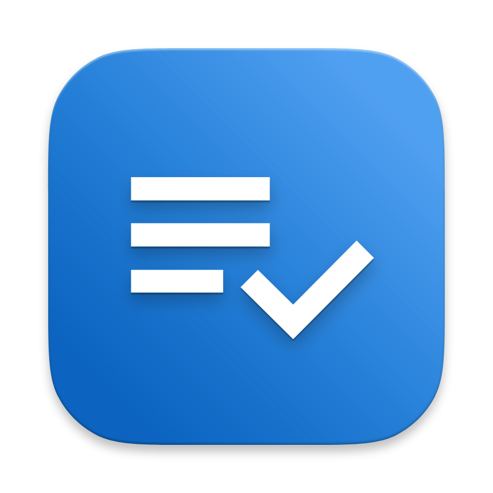

  

# Testing Tools Xcode Extension

## Important Notes on Developing Xcode Extensions
- It's not documented anywhere, but to test your extension you need to 'Embed and Sign' the `XcodeKit.framework` on the extension target. 
- As per [NSHipster](https://nshipster.com/xcode-source-extensions/), I added my frameworks path to 'Framework Search Paths' in 'Build Settings' to allow `XcodeKit` to show up in tests.
- If you want to test a file in the `TestingToolsExtension`, you have to change its Target Membership to include `TestingToolsTests` or the tests won't compile. I can't work out why this is the case, but a few examples online do the same.

## How to Archive Build (Development Only)
To build a local copy of the app for local use:
1. Archive the app (Product > Archive)
2. Distribute App > Custom > Copy App 
3. Open the app and restart Xcode

## Useful Resources for Xcode Extensions

- [Working with XcodeKit by Aryaman Sharda](https://www.youtube.com/watch?v=hsX-b7lobF0)
- [NSHipster Xcode Source Extensions](https://nshipster.com/xcode-source-extensions/)
- [Source editor extensions starting guide](https://kowei-chen.medium.com/xcode-extension-1-5-starting-guide-519a95bdc865)

## App Icon

You can find the source for the app icon [here](https://icon.kitchen/i/H4sIAAAAAAAAAzWQwU7DMAyGXwWZaw8bMJB6nRhXhHpDaHITJ43m1lWajlXT3h0nZTkk9h%2Fni39f4Yw80wT1FSzGU9NRT1A75IkqcH7PYcSY8vVEeoAlhzMnqCAYGVQYGRcOUzqitUfTkTnBrYLWN8uoIPARbaAhP2j9xz1RnBGWuNWKx9dNu3UvWlCkpyxtNm9ojEo4eFbM9nmnUHeHmv%2BuikSX3FfTlOwgK91hH3hR%2FUtaSfJwYLrkFoQt1CnOai4k5GDWrMDfnSOTdBRATGdMVIif6isMPkOTjNrKroIYfKff5FDpSfo1ZnJFLbR9NpO9uLLyUHqxM%2BdZf6svGyXYPEaZdP%2BlVvcejWY%2Ftz%2B4QZLhlgEAAA%3D%3D).